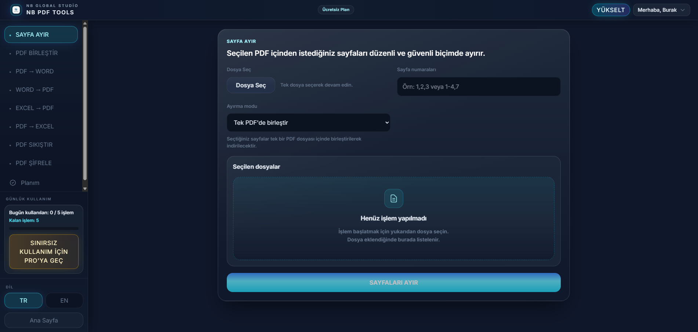
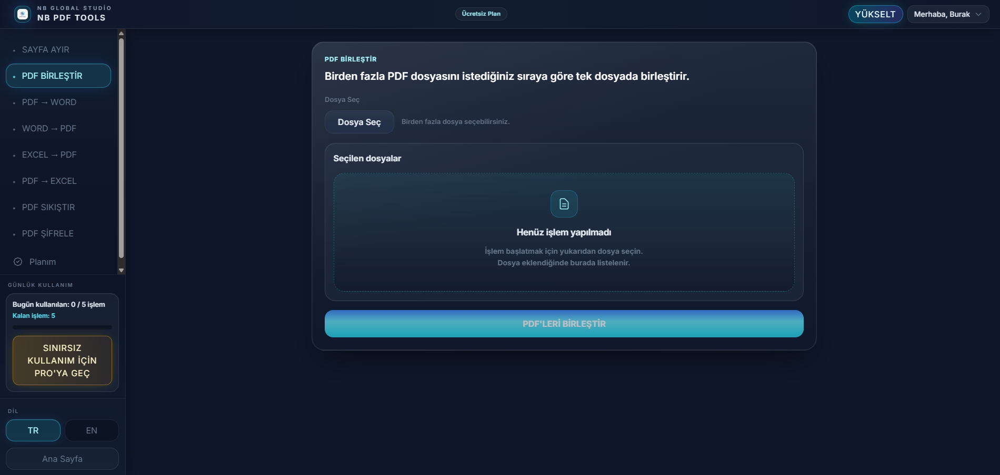

# NB PDF TOOLS

Çoklu PDF ve ofis belgesi işlemlerini tek yerden yönetmenizi sağlayan araç seti. **Windows masaüstü uygulaması** ve tarayıcıda çalışan **web sürümü** (kimlik doğrulama, abonelik özeti ve PDF API) birlikte sunulur.

---

## Türkçe

### Proje açıklaması

NB PDF TOOLS; PDF birleştirme, sayfa ayırma, Word/Excel ile dönüşümler, sıkıştırma ve şifreleme gibi işlemleri kullanıcı dostu arayüzlerle sunar. Masaüstü sürümü yerel Python motoru üzerinde çalışır; web sürümü FastAPI tabanlı PDF servisi, Node.js kimlik API’si ve React arayüzünden oluşur.

### Özellikler

**PDF ve belge işlemleri**

- PDF birleştirme  
- PDF sayfa ayıklama (tek veya ayrı dosyalar)  
- PDF → Word  
- Word → PDF  
- Excel → PDF  
- PDF → Excel (tablo koruma / düz metin yaklaşımları)  
- PDF sıkıştırma  
- PDF şifreleme  

**Web sürümü (ek)**

- Çok dilli arayüz ve landing deneyimi  
- E-posta ile kayıt / giriş, e-posta doğrulama  
- İsteğe bağlı Google ile oturum  
- Plan özeti, kullanım ve plan değiştirme (geliştirme odaklı akış)  
- İletişim formu ve dosya günlüğü (kimlik API)  

**Masaüstü (ek)**

- Yerel dosya seçimi ve ilerleme diyalogları  
- İsteğe bağlı destek sohbeti (harici HTTP API ile yapılandırılır; ayrıntı için `support_config.example.json`)

### Ekran görüntüleri

| Web — çalışma alanı önizlemesi | Web — birleştirme önizlemesi |
|--------------------------------|------------------------------|
|  |  |

**Masaüstü:** Üretim ekran görüntülerini `docs/screenshots/` veya `release/screenshots/` altına ekleyebilir; yukarıdaki tabloya yeni satır veya görsel bağlantıları ekleyebilirsiniz.

### Teknolojiler

| Katman | Araçlar |
|--------|---------|
| Masaüstü | Python 3.11+, CustomTkinter, PyPDF2, pikepdf, Pillow, Tesseract / Poppler (ortamınıza göre), isteğe bağlı Microsoft Office |
| Web arayüzü | React, TypeScript, Vite, Tailwind CSS |
| PDF web API | Python, FastAPI, Uvicorn; mevcut `src/pdf_engine` motorunun yeniden kullanımı |
| Kimlik / SaaS API | Node.js, Express, Prisma, SQLite (geliştirme), JWT, Nodemailer |
| Geliştirme orkestrasyonu | npm, `concurrently` (kök `npm run dev`) |

### Kurulum (kısa)

1. Depoyu klonlayın.  
2. **Web (önerilen tek komut):** kökte `npm run install-all`, ardından `web/api/.env` ve `web/frontend/.env` dosyalarını `.env.example` dosyalarından oluşturup doldurun; `npm run prisma:push` ile veritabanını hazırlayın; `npm run dev` ile üç servisi birlikte başlatın.  
3. **Masaüstü:** `python -m pip install -r requirements.txt` ve harici bağımlılıklar (Tesseract, Poppler, Word/Excel) — ayrıntılar için `SETUP_NOTES.txt`.  
4. Ayrıntılı adımlar: **[SETUP.md](SETUP.md)**, birlikte çalıştırma: **[CALISTIRMA.md](CALISTIRMA.md)**, web mimarisi: **[web/README.md](web/README.md)**.

### Kullanım

- **Web:** Tarayıcıda `http://localhost:5173` (kökten `npm run dev` ile). PDF istekleri `localhost:8000`, oturum API’si `localhost:4000` üzerindedir.  
- **Masaüstü:** Proje kökünde `python -m src`.  
- **Masaüstü .exe derleme:** [docs/MASAUSTU_BUILD.md](docs/MASAUSTU_BUILD.md)  
- **Üretim önizlemesi (web):** Kökte `npm run build:all` sonrası `npm run start` (önce `.env` ve derleme çıktılarının hazır olduğundan emin olun).

---

## English

### Overview

NB PDF TOOLS is a document toolkit for merging, splitting, converting, compressing, and securing PDFs, plus Word/Excel workflows. It ships as a **Windows desktop app** (Python) and a **web stack** (FastAPI PDF service, Node.js auth API, React UI).

### Features

- Merge PDFs, extract pages, convert PDF ↔ Word/Excel, compress and encrypt PDFs  
- Web: localized UI, email auth & verification, optional Google sign-in, subscription-style plans (dev-oriented), contact form  
- Desktop: local file workflows, optional support chat via your own HTTP API (`support_config.example.json`)

### Screenshots

| Web workspace (preview) | Web merge (preview) |
|-------------------------|---------------------|
|  |  |

Add desktop captures under `docs/screenshots/` or `release/screenshots/` and link them here if needed.

### Tech stack

Python / CustomTkinter / PyPDF2 / pikepdf (desktop); React / TypeScript / Vite / Tailwind (frontend); FastAPI (PDF API); Node / Express / Prisma (auth API); root `npm run dev` runs all three dev processes via `concurrently`.

### Quick setup

1. Clone the repo.  
2. **Web:** From the repo root run `npm run install-all`, copy `web/api/.env.example` → `web/api/.env` and `web/frontend/.env.example` → `web/frontend/.env`, run `npm run prisma:push`, then `npm run dev`.  
3. **Desktop:** `pip install -r requirements.txt` and follow **SETUP_NOTES.txt** for Tesseract, Poppler, and Office.  
4. More detail: **SETUP.md**, run scripts: **CALISTIRMA.md**, web architecture: **web/README.md**.

### Usage

- **Web:** Open `http://localhost:5173` after `npm run dev` from the repository root.  
- **Desktop:** `python -m src` from the repository root.  
- **Desktop .exe build (Turkish guide):** [docs/MASAUSTU_BUILD.md](docs/MASAUSTU_BUILD.md)  
- **Web production-style run:** `npm run build:all` then `npm run start` from the root.

---

## Lisans / License

Bu proje **MIT License** ile lisanslanmıştır. Ayrıntılar için [LICENSE](LICENSE) dosyasına bakın.  
This project is licensed under the **MIT License** — see [LICENSE](LICENSE).
